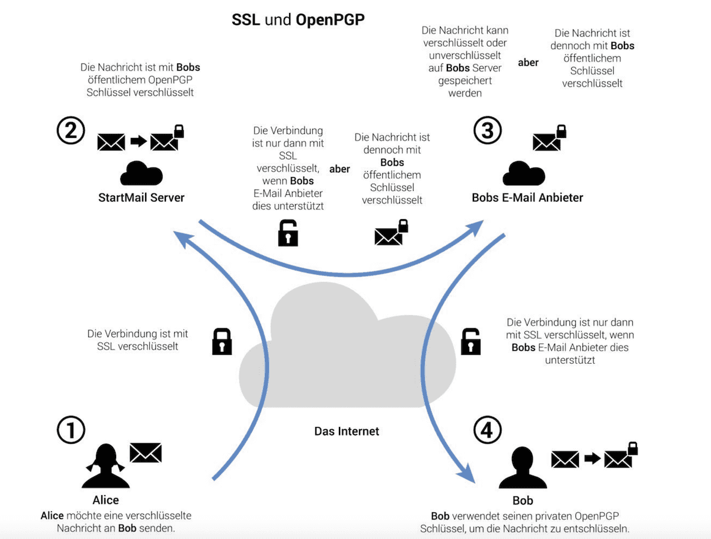
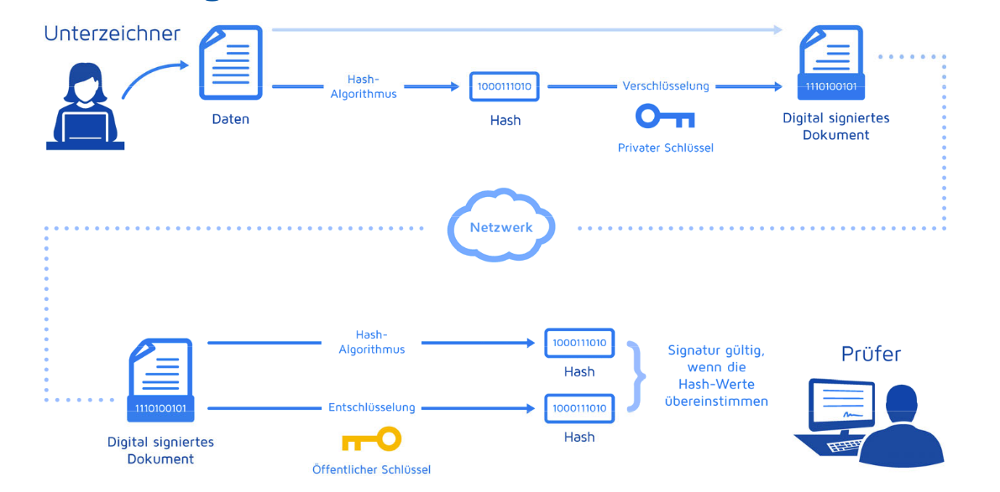

## GnuPG

ist ein Werkzeug zum sicheren Austausch von Nachrichten.

🎯 Sie verstehen was GnuPG ist und können es anwenden.

---
### Pretty Good Privacy

* GnuPG ist eine Implementation von OpenPGP aka PGP
* PGP ist eine Sammlung von Geheimschlüsselalgorithmen zur Verschlüsselung einer Nachricht
* PGP setzt auf eine hybride Verschlüsselung

---
### Hybride Verschlüsselung

---

* Public/Private Key Krypto ist 1.000 mal langsamer als symmetrische Verschlüsselung
* Daten werden mit einem zufällig generierten Key symmetrisch verschlüsselt
* Der Key wird asymmetrisch verschlüsselt und mitgesendet

---
### PGP-Entschlüsselung

Der Sitzungsschlüssel wird mit dem privaten Schlüssel entschlüsselt.

---
### E-Mail ist unsicher

> Warum schicken wir Briefe nicht als Postkarten? Mit E-Mail tun wir genau das.

E-Mails werden heute in den meisten Fällen sicher übertragen. Alle anderen [Sicherheitsziele](slides0.md#Sicherheitsziele) werden aber verletzt.

---
### E-Mail ist fast unsicher

Wie gelangt Alice an den öffentlichen Schlüssel von Bob?

---
### Direktes Vertrauen

Damit sicher kommuniziert werden kann, braucht es ein direktes Vertrauen.

---

Öffentlicher Schlüssel kopieren von
* Website
* Key Exchange Server
* Mail

---
### Schlüsselbund

GnuPG ist metaphorisch ein Schlüsselbund. Damit verwalten wir:

* Eigenen privaten und öffentlichen Schlüssel
* Öffentliche Schlüssel von anderen
* Verschlüsseln und signieren von Nachrichten
* Entschlüsseln und verifizieren von Nachrichten

---
### Signieren vs. Verschlüsseln

**Signieren**

Beim Signieren wird dem **privaten** Schlüssel eine Signatur erstellt. Die Signatur wird an dich Nachricht angehängt.

**Verschlüsseln**

Beim Verschlüssel wird mit **öffentlichen** Schlüssel des Empfängers die Nachricht verschlüsselt.

---
### Digitale Signatur

---
### Übungen

🎬 Lösen sie die [Übung](übungen.md) 2.

---
### Als Nächstes

Weiter geht es mit [Lektion 2 - Zertifikate, Signaturen und Protokolle](../topic-2/README.md).
