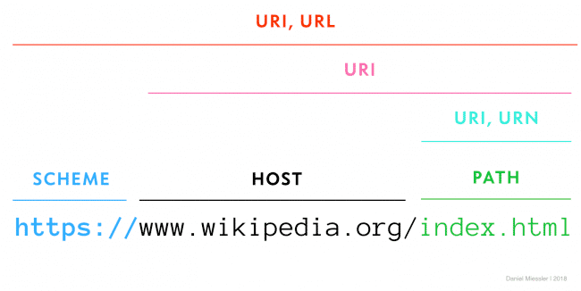
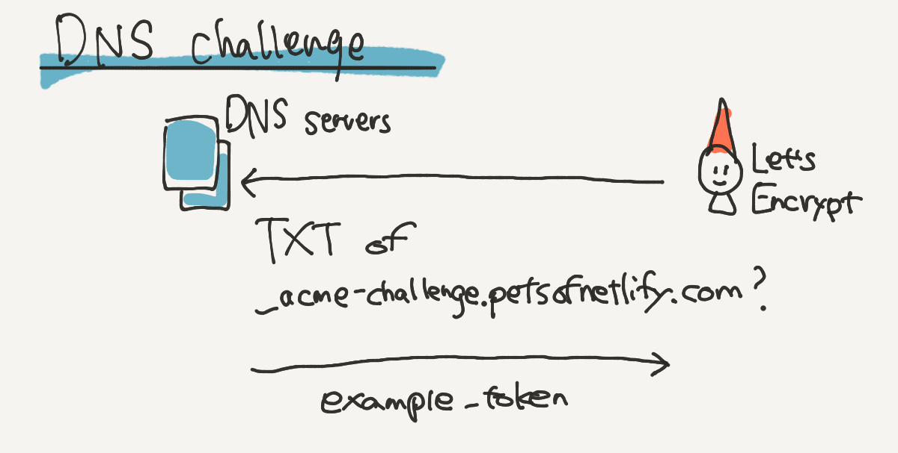
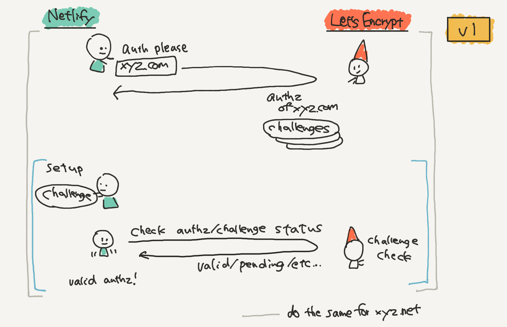

## Sichere Webprotokolle

und wie diese funktionieren.

🎯  Sie lernen sichere Protokolle kennen und können damit einen Webseitenaufruf nachvollziehen.

---
### Aufruf einer Webseite

Wenn wir eine Webseite aufrufen, dauert es weniger als eine Sekunde.


In dieser Sekunde passiert jedoch sehr viel.

---
### Nachrichtenaustausch

Wir erinnern uns an:

```mermaid
graph LR;
    A[Alice]-->|Hi Bob|B[Bob];
```

Jetzt ist es:

```mermaid
graph LR;
    A[Client]-->|Request|B[Server];
```

---
### URL

Eine Unified Resource Locater (URL) wird in der Adressleiste des Browsers eingegeben.



---
### IP-Adresse

Im Internet sind Geräte anhand der IP-Adresse erreichbar.  
↪️ Für eine Verbindungsaufnahme braucht es die IP-Adresse des Servers.


---
### Eigene IP-Adresse mit Python

<iframe src="https://trinket.io/embed/python3/aa282ed1b2" width="100%" height="356" frameborder="0" marginwidth="0" marginheight="0" allowfullscreen></iframe>

---
### Hostname

Damit man sich nicht IP-Adressen merken muss, kann einer IP-Adresse ein sprechender Name zugeordnet werden.

`93.184.216.34` <-> `www.example.com`.

---
### Hostname mit Python

<iframe src="https://trinket.io/embed/python3/3e3fe071aa" width="100%" height="356" frameborder="0" marginwidth="0" marginheight="0" allowfullscreen></iframe>

---
### DNS-Server

Der Domain-Name-System (DNS) Server verwaltet die Zuordnung Hostname und IP-Adresse.


---
### DNS mit Python

<iframe src="https://trinket.io/embed/python3/c2db81fc64" width="100%" height="356" frameborder="0" marginwidth="0" marginheight="0" allowfullscreen></iframe>

---
### HTTP

Der Browser kommuniziert mit  dem HyperText Transfer Protocol (HTTP). Das Protokoll ist einfach:

1. Anfrage: HTTP Reqeust
2. Antwort: HTTP Reponse

---
### HTTP Request


---
### HTTP Response


---
### HTTPS

Die Übertragung der Daten erfolgt in Klartext. Deshalb wurde HyperText Transfer Protocol **Secure** (HTTPS) entwickelt 🧐.

Der HTTP-Austausch wird hierbei mit einem Verschlüsselungsprotokoll geschützt:
* Secure Socket Layer (SSL)
* Transport Layer Security (TLS)

---


---
### SSL/TLS

-   SSL 1.0: Aufgrund von Sicherheitsproblemen nie öffentlich freigegeben.
-   SSL 2.0: Veröffentlicht 1995. Seit 2011 veraltet.
-   SSL 3.0: Veröffentlicht 1996. Seit 2015 veraltet.
-   TLS 1.0: 1999 als Upgrade auf SSL 3.0 veröffentlicht. Seit 2020 veraltet.

---

-   TLS 1.1: Veröffentlicht 2006. Seit 2020 veraltet.
-   TLS 1.2: Veröffentlicht 2008.
-   TLS 1.3: Veröffentlicht 2018.

---
### TLS

* Verschlüsselungsprotokoll zur sicheren Datenübertragung im Internet
* Beim TLS Handshake findet ein sicherer Schlüsseltausch und Authentisierung statt
* Die Datenübertragung erfolgt mit symmetrischen Schlüssel

🧠 Good-to-know: Ab Version 1.3 findet Schlüsseltausch nur noch mit Diffie-Hellmann statt

---
### TLS-Handshake


---
### TLS-Handshake mit Curl

```bash
curl -v https://example.com
*   Trying 93.184.216.34:443...
* TCP_NODELAY set
* Connected to example.com (93.184.216.34) port 443 (#0)
* ALPN, offering h2
* ALPN, offering http/1.1
* successfully set certificate verify locations:
*   CAfile: /etc/ssl/certs/ca-certificates.crt
  CApath: /etc/ssl/certs
* TLSv1.3 (OUT), TLS handshake, Client hello (1):
* TLSv1.3 (IN), TLS handshake, Server hello (2):
* TLSv1.3 (OUT), TLS change cipher, Change cipher spec (1):
* TLSv1.3 (OUT), TLS handshake, Client hello (1):
* TLSv1.3 (IN), TLS handshake, Server hello (2):
* TLSv1.3 (IN), TLS handshake, Encrypted Extensions (8):
* TLSv1.3 (IN), TLS handshake, Certificate (11):
* TLSv1.3 (IN), TLS handshake, CERT verify (15):
* TLSv1.3 (IN), TLS handshake, Finished (20):
* TLSv1.3 (OUT), TLS handshake, Finished (20):
* SSL connection using TLSv1.3 / TLS_AES_256_GCM_SHA384
* ALPN, server accepted to use h2
* Server certificate:
*  subject: C=US; ST=California; L=Los Angeles; O=Internet Corporation for Assigned Names and Numbers; CN=www.example.org
*  start date: Nov 24 00:00:00 2020 GMT
*  expire date: Dec 25 23:59:59 2021 GMT
*  subjectAltName: host "example.com" matched cert's "example.com"
*  issuer: C=US; O=DigiCert Inc; CN=DigiCert TLS RSA SHA256 2020 CA1
*  SSL certificate verify ok.
* Using HTTP2, server supports multi-use
* Connection state changed (HTTP/2 confirmed)
* Copying HTTP/2 data in stream buffer to connection buffer after upgrade: len=0
* Using Stream ID: 1 (easy handle 0x56152e9a5ea0)
> GET / HTTP/2
> Host: example.com
> user-agent: curl/7.68.0
> accept: */*
>
* TLSv1.3 (IN), TLS handshake, Newsession Ticket (4):
* TLSv1.3 (IN), TLS handshake, Newsession Ticket (4):
* old SSL session ID is stale, removing
* Connection state changed (MAX_CONCURRENT_STREAMS == 100)!
< HTTP/2 200
< age: 596248
< cache-control: max-age=604800
< content-type: text/html; charset=UTF-8
< date: Thu, 03 Jun 2021 13:47:23 GMT
< etag: "3147526947+ident"
< expires: Thu, 10 Jun 2021 13:47:23 GMT
< last-modified: Thu, 17 Oct 2019 07:18:26 GMT
< server: ECS (dcb/7F5B)
< vary: Accept-Encoding
< x-cache: HIT
< content-length: 1256
<
<!doctype html>
<html>
<head>
    <title>Example Domain</title>

    <meta charset="utf-8" />
    <meta http-equiv="Content-type" content="text/html; charset=utf-8" />
    <meta name="viewport" content="width=device-width, initial-scale=1" />
    <style type="text/css">
    body {
        background-color: #f0f0f2;
        margin: 0;
        padding: 0;
        font-family: -apple-system, system-ui, BlinkMacSystemFont, "Segoe UI", "Open Sans", "Helvetica Neue", Helvetica, Arial, sans-serif;

    }
    div {
        width: 600px;
        margin: 5em auto;
        padding: 2em;
        background-color: #fdfdff;
        border-radius: 0.5em;
        box-shadow: 2px 3px 7px 2px rgba(0,0,0,0.02);
    }
    a:link, a:visited {
        color: #38488f;
        text-decoration: none;
    }
    @media (max-width: 700px) {
        div {
            margin: 0 auto;
            width: auto;
        }
    }
    </style>
</head>

<body>
<div>
    <h1>Example Domain</h1>
    <p>This domain is for use in illustrative examples in documents. You may use this
    domain in literature without prior coordination or asking for permission.</p>
    <p><a href="https://www.iana.org/domains/example">More information...</a></p>
</div>
</body>
</html>
* Connection #0 to host example.com left intact
```

---

### Webseite aufrufen

Beim Aufruf einer Webseite passiert also folgendes:

1. Nachschlagen IP-Adresse anhand Hostname
2. TLS-Handshake durchführen
3. Zertifikate verfizieren
4. Webseite darstellen

---

### Webseite aufrufen mit Python

<iframe src="https://trinket.io/embed/python3/e58ac23aee" width="100%" height="356" frameborder="0" marginwidth="0" marginheight="0" allowfullscreen></iframe>

---
### Zertifikatsverwaltung

🤔 Es gibt inzwischen Millionen von Webseiten. Wie werden all diese Zertfikate verwaltet?

Schauen wir uns dazu eine Statistik an: <https://trends.builtwith.com/ssl>.

---
### LetsEncrypt

Let’s Encrypt ist eine Zertifizierungsstelle, die Ende 2015 in Betrieb gegangen ist und **kostenlose X.509-Zertifikate** für **Transport Layer Security** anbietet. Die Zertifikate haben eine **Gültigkeit** von jeweils 90 Tagen und können manuell oder automatisch erneuert werden.

---
### LetsEncrypt Hierarchy


---
### LetsEncrypt Challenge

Der Webserver kann mit dem LetsEncrypt eine Verhandlung starten. Bei der Verhandlung wird verifiziert, dass man der **Besitzer der Domäne** ist.

Ist die Verhandlung abgeschlossen, können Zertifikate von LetsEncrypt für die verfizierten Domänen bezogen werden.

---
### HTTP Challenge


---
### DNS Challenge



---
### Challenge ausführen



---
### Zertifikat abholen


---
### Übungen

🎬 Lösen sie die [Übung](übungen.md) 3.

---