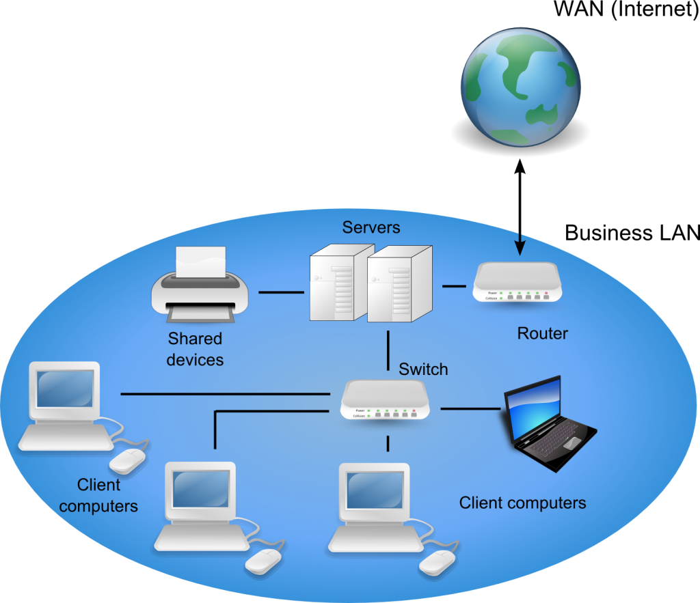

## Unsichere Webprotokolle

im Netzwerk des Unternehmens.

🎯  Sie lernen welche Protokolle unsicher sind.

---

### Business LAN

Bei der Arbeit bewegt man sich meistens im Local Area Network (LAN) des Unternehmens.

🤔 Welcher Datenaustausch ist bei eurem Unternehmen sicherer?
- Austausch innerhalb LAN
- Austausch ausserhalb LAN mit Internet

---

### Unsichere Protokolle

Im Netzwerk des Unternehmens sind oftmals unsichere Protkolle im Einsatz:

* **LDAP**: Authentisierung von Benutzern
* **SMTP**: Mail-Versand
* **SNMP**: Verwaltung von Netzwerkgeräten
* **HTTP**: Websites ohne Zertitifikate

🤔 Könnt ihr das bestätigen?

---

### Vernetzung der Geräte

Die Geräte im Spital werden immer vernetzter (oder sind es schon). Neuere Standards wie [HL7](https://www.hl7.ch/) kommen zu Einsatz. Diese regeln das Nachrichtenformat, aber nicht die sichere Übertragung.

---

### FHIR

Das kennt ihr vermutlich.

[FHIR](https://www.hl7.org/fhir/) steht für Fast Healthcare Interoperability Resources, und ist wie der Name schon sagt mit
dem Ziel angetreten, schnelle und einfache Interoperabilität in medizinischen Anwendungen zu
ermöglichen.

---

### Sicherheit in FHIR

Sicherheit ist optional.

> Fast Healthcare Interoperability Resources (FHIR) is not a security protocol, nor does it define any security related functionality.

<https://www.hl7.org/fhir/security.html>

---

**Kommunikationssicherheit**: Jegliche Kommunikation **soll** durch Transport Layer Secu-
rity (TLS) beziehungsweise Secure Sockets Layer (SSL) verschlüsselt erfolgen.

**Authentifizierung**: BenutzerInnen **sollten** sich authentifizieren. **OAuth** ist hier empfohlen.

**Zugriffskontrolle**: FHIR hat eine auf Sicherheitsmarkierungen basierte Infrastruktur (Se-
curity Label) definiert, um Zugriffskontrolle **prinzipiell** zu ermöglichen. 

**Digitale Signaturen**: FHIR unterstützt Signaturen.

🤔 Wer ist verantwortlich für die sichere Übertragung?

---

### Analyse Schutzziele

Kurze Analyse der Schutzziele bezl. FHIR:

| Schutzziel         | Status                                         |
| ------------------ | ---------------------------------------------- |
| Vertraulichkeit 😈 | Client ist deklariert, aber nicht kontrolliert |
| Integrität 💎      | Nachrichten werden signiert                    |
| Authentitzität 🙋‍ | Authentisierung mit OAuth                      |
| Verbindlichkeit 📝 | Gelöst mit Protokollierung                     |

---

### Ein Aufruf

Stellt in eurem Unternehmen sicher, dass:

* Geräte und Computer über sichere Kanäle kommunzieren
* Der Zugriff auf eine Schnittstelle authorisiert ist
* Nachrichten signiert werden