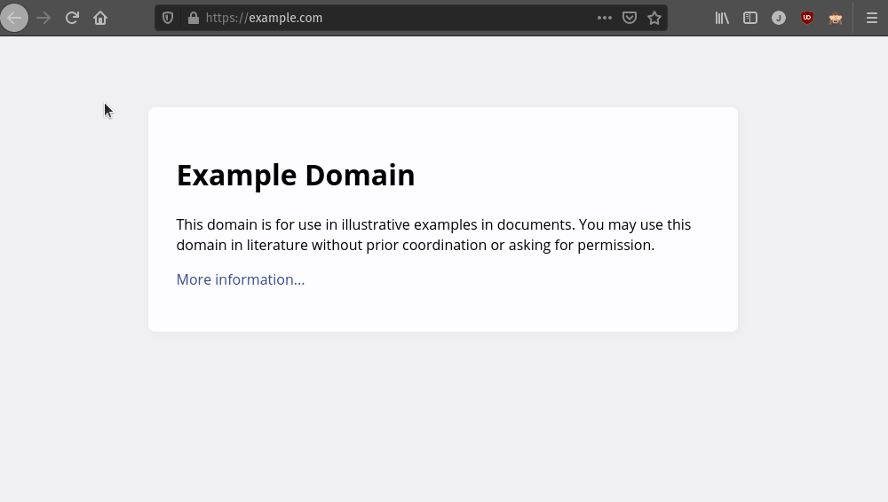

# Übungen Thema 5

## Aufgaben

### Aufgabe 1 - Zertifikat betrachten

Wir schauen uns ein Zertifkat an. Öffnen Sie die Adresse <https://example.com> in ihrem Browser und schauen Sie sich das Zertifikat an. Hier das Vorgehen in Firefox:



Beantworten Sie die folgenden Fragen:

* Wie lange ist das Zertifikat gültig?
* Sie lautet die Seriennummer des Zertifikats?
* Wie lautet die Kennung des Zertifikatsinhabers?
* Wie lautet der Name des Zertifikatsausstellers?
* Welcher Signaturalgorithmus ist zum Einsatz gekommen?

### Aufgabe 2 - x509 in Kleopatra betrachten

Versuchen Sie das Zertifikate herunterzuladen und in Kleopatra zu importieren.

* Können Sie das Zertifikate zum signieren von Nachrichten verwenden? Warum nicht?

Mit dem folgenden Kommandozeilen-Befehl wurde ein Zertifikat für [https://medizintechnik-hf.ch/](https://medizintechnik-hf.ch/) erstellt. Betrachten Sie den Vorgang genauer:

```bash
openssl req -newkey rsa:4096  -x509  -sha512  -days 365 -nodes -out certificate.pem -keyout privatekey.pem
....+.......+..+.+......+...+...+++++++++++++++++++++++++++++++++++++++++++++++++++++++++++++++++*.+....+.........+..+...+.+.........+..+......+...+++++++++++++++++++++++++++++++++++++++++++++++++++++++++++++++++*...........+...+............+...+...+...+......+...+...+...+.+...+...+...+..+.........+......+....+.....................+........+...............+.+..+.......+........+......+.+...+........+...............+............+......+.......+...+....................+.+......+............+...+........+...............+....+.................................+.........+..............+......+.............+...+.....+..........+...............+...+..+.............+.........+...+..+......+.+.....+.........+.+++++++++++++++++++++++++++++++++++++++++++++++++++++++++++++++++
..........+.....+...+....+.....+.+............+++++++++++++++++++++++++++++++++++++++++++++++++++++++++++++++++*.....+..+.........+....+..+...+....+++++++++++++++++++++++++++++++++++++++++++++++++++++++++++++++++*.......+..................+..........+......+....................+......+......+...+....+..+.+........+.+...+..+.+.....+..........+.......................+.+........+.+......+.....................+........+.+........+......+....+..+.+..................+......+..................+...............+..+.+...............+...............+..+...+...+..........+.....+..........+......+.....+................+..+.+..+.........+.+...+...........+....+.....+....+..+.+++++++++++++++++++++++++++++++++++++++++++++++++++++++++++++++++
-----
You are about to be asked to enter information that will be incorporated
into your certificate request.
What you are about to enter is what is called a Distinguished Name or a DN.
There are quite a few fields but you can leave some blank
For some fields there will be a default value,
If you enter '.', the field will be left blank.
-----
Country Name (2 letter code) [AU]:CH
State or Province Name (full name) [Some-State]:OW
Locality Name (eg, city) []:Sarnen
Organization Name (eg, company) [Internet Widgits Pty Ltd]:Höhere Fachschule für
Medizintechnik Sarnen
Organizational Unit Name (eg, section) []:
Common Name (e.g. server FQDN or YOUR name) []:medizintechnik-hf.ch
Email Address []:info@medizintechnik-hf.ch
```

Erstellen Sie nach dem gleichen Prinzip ein x509-Zertifikat in Kleopatra und beantworten Sie diese Frage:

* Können wir das Zertifikat für die Website verwenden?
* Was würde passieren, wenn jemand die Website mit diesem Zertifikat besucht?
* Warum wird dem Zertifikat auf <https://example.com> vertraut?