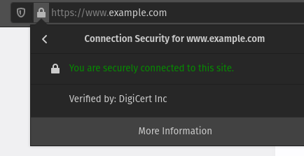
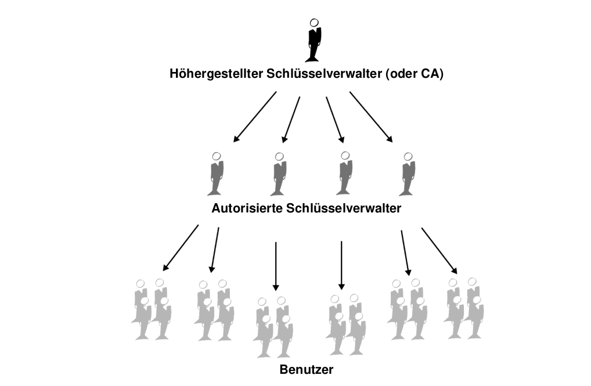
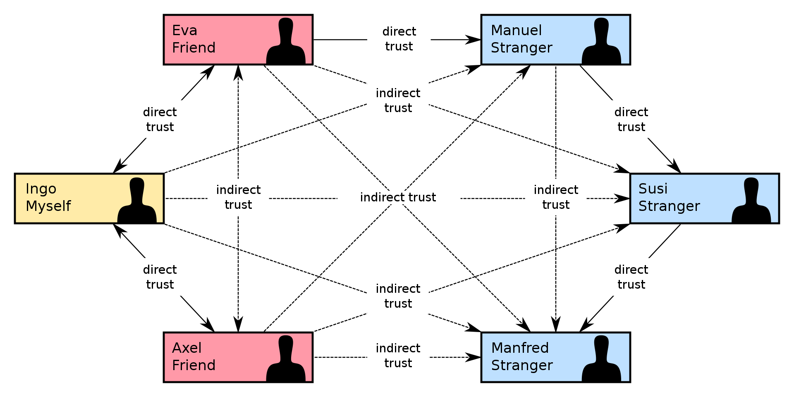
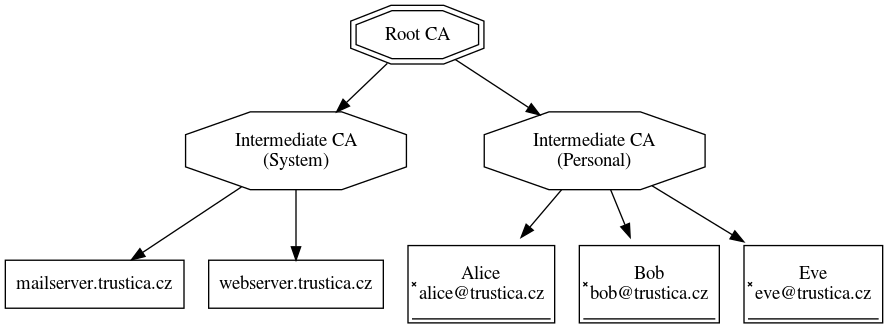
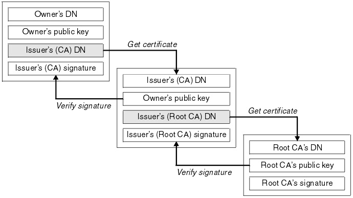
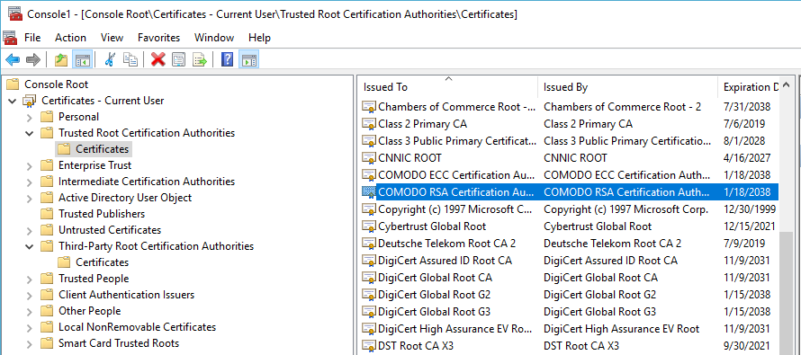

# Slides Thema 6
## Vertrauen

und Gültigkeit.

🎯  Wir verstehen wie das Vertrauen zu Digitialzertifikaten hergestellt wird.

---

### Verifiziert von

Besucht man <https://example.com> und klickt auf das Schloss, sieht man folgendes:

---

Die Adresse `www.example.com` ist verifizert von `DigiCert Inc`.

🤔 Wer ist `DigiCert Inc` und warum vertraue ich ihnen?

---
### Vertrauensmodelle

Um das zu verstehen, müssen wir zuerst verschiedene Vertrauensmodelle betrachten:

* Direktes Vertrauen 🧑‍🤝‍🧑
* Vertrauenshierarchie 🔝
* Web of Trust 🕸️

Und definieren was Gültigkeit ✅ ist.

---
### Gültigkeit

> Gültigkeit bedeutet Vertrauen dahingehend, daß ein öffentliches Schlüsselzertifikat dem angegebenen Eigentümer gehört.

---
### Direktes vertrauen

Benutzer vertraut auf die Gültigkeit des Schlüssels, da dessen Herkunft bekannt ist.

---
### Vertrauenshierarchie

Im hierarchischen Modell gibt es eine Anzahl Root-Zertifikate (Stamm 🌳). Davon werden Zertifizierungsinstanzen und Zertifikate (Äste 🌱 und Blätter 🍃) abgeleitet.

---

---
### Web of Trust

Ist eine Kombination der beiden vorherigen Modellen. In sechs Schritten kann man zu jedem Menschen eine Verbindung aufnehmen 🤝.

Händeschütteln -> Schlüssel austauschen -> Es entsteht ein Netz aus Vertrauen

---

---
### Gültigkeit überprüfen

Die Gültigkeit kann wie folgt geprüft werden:

1. Erstellen Fingerabdruck des Zertifikats
2. Fingerabdruck bei Herausgeber nachfragen
3. Fingerabdrücke vergleichen

Eine weitere Möglichkeit ist die Prüfung durch Dritte -> Zertifizierungsinstanz

---
### Zertifizierungsinstanz (CA)

"Der Hauptzweck einer CA ist grundsätzlich, einen **öffentlichen Schlüssel** mit im Zertifikat enthaltenen **Identifikationsinformationen** zu **verbinden** und somit Dritten zu versichern, daß eine gewisse **Sorgfalt bei der Verbindung** der Identifikationsinformationen verwendet wurde und der Schlüssel gültig ist."

---

Dazu die Hierarchie:

---
### Zertifikat verifzieren

🤔 Wie wird das Zertifikat von  `DigiCert Inc` verifiziert?

🙋 Es wird die hierarchische Zertifikatskette überprüft. Wenn wir der Root-CA vertrauen, vertrauen wir `DigiCert Inc`.

---

---

### Dem Browser vertrauen

Wenn man eine Browser auf dem Computer installiert oder aktualisiert, wird immer eine Liste von Root-CA-Zertifikaten mitgeliefert.

🧠 Nice to know: [Mozilla Included CA Certificate List](https://wiki.mozilla.org/CA/Included_Certificates)

---

Auf Windows werden Zertifikate zentral im *Certificate Manager* verwaltet.

---
### Aufgaben

🎬 Lösen Sie die [Aufgaben](excercise6.md#Aufgaben) 1 in Gruppen oder Breakout-Rooms.

---
### Zusammenfassung

Der Zugriff auf eine Webseite ist sicher:

Wenn `https://` verwendet wird.\
↪️Die Adresse mit einem Zertifikat verknüpft ist.\
↪️Dem Herausgeber des Zertifikats vertraut wird.\
↪️Dem Browser vertraut wird.\
↪️Der Browser der Root-CA vertraut.

---
### Probleme CA

🤔 Kann man den CAs wirklich vertrauen?

🙋 Nicht vollständig:

* [Beware of Applications Misusing Root Stores ](https://blog.mozilla.org/security/2021/05/10/beware-of-applications-misusing-root-stores/)
* [Timeline of Certificate Authority Failures](https://sslmate.com/certspotter/failures)
* [Stuxnet](https://de.wikipedia.org/wiki/Stuxnet)

Es werden immer wieder unauthorisierte Zertifikate erstellt.

---
### Sicherheit im Web

Unabhängig davon ist aber die Verbindung mit einer Webseite ziemlich sicher.

Mehr dazu in [Sichere Webprotokolle](../topic-7/slides7.md).
